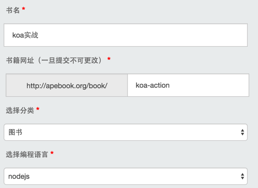
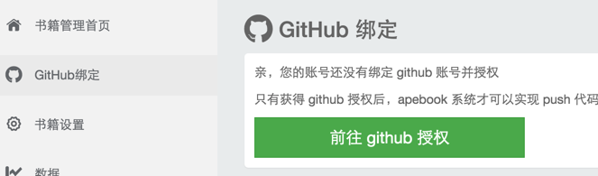
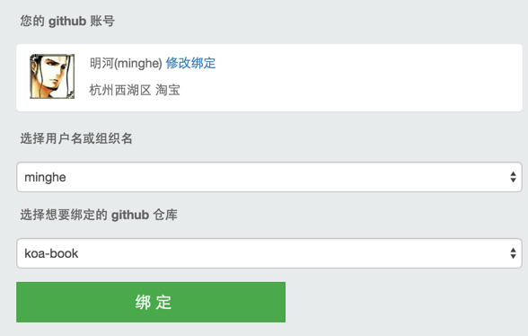
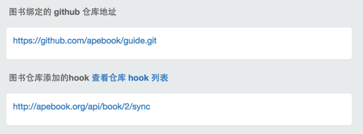

# 如何将图书同步到 apebook

打开 [apebook.org](http://apebook.org/) 注册一个账号。

点击 “创建图书”，进入创建页面，填写图书关键信息：

创建成功后，需要绑定图书的 github 仓库：
 

 
点击 “前往 github 授权” ，会跳转到 github 网站进行服务授权，apebook 只会给仓库添加 hook，监听仓库的 push 与 push request 操作，用于仓库代码的同步。
 
（github 网站比较慢，有时会等比较久。）

授权成功后，就会看到如下界面：

选择要绑定的用户与仓库，点击“绑定”即可，成功绑定后会看到 hook 信息：

绑定成功后，只要你的图书有存在推送，就会同步到 apebook 服务器，同时会触发 apebook 的渲染。

默认图书是不公开的，不会出现在[图书馆](http://www.apebook.org/library)页面中，图书编写完成后，可以在图书管理页面点击“公开图书”，即可在图书馆页面中出现。
