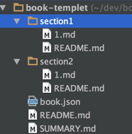

# 如何编写图书

创建一个 github 仓库，比如 [demo-book](https://github.com/apebook/guide)。

克隆仓库到本地：

    git clone https://github.com/apebook/guide.git
    
## 初始化图书工程

有二种方法来初始化图书工程：

* 如果是前端工程师，可以使用 [gitbook](https://www.npmjs.com/package/gitbook) node 工具
* 如果亲不懂的 node ，没关系，可以采用第二种方案

### 1.使用 node 工具

使用 npm 安装 gitbook-cli 包：

    npm install gitbook-cli -g

网上大部分教程都是错的，都是采用老的 npm 包： npm install gitbook -g 。

进入图书目录，运行命令：

    gitbook init
    
第一次会提示安装 gitbook 某个版本，按照提示操作即可。

执行 gitbook init 后，就会生成二个核心文件：

* SUMMARY.md ：图书目录文件
* README.md : 图书介绍

### 2.使用 book-templet 

[book-templet](https://github.com/apebook/book-templet) 是一个可以参考的图书模板。

进入图书目录，设置个远程分支：

    git remote add templet https://github.com/apebook/book-templet.git

拉取代码到本地目录：

    git pull templet master

## SUMMARY.md

SUMMARY.md 是最重要的文件，用于编写图书的目录，目录必须遵循如下的格式：
    
    # 目录
    
    * [第一章](section1/README.md)
        * [第一节](section1/1.md)
    * [第二章](section2/README.md)
        * [第一节](section2/1.md) 

留意：md 文件的路径不可以加 **./**，比如 ./section1/README.md ，会导致渲染失败。

建议每一章一个目录：

    

每一个 md 文件，请以 **# 标题** 开头。    
    
一本图书就这么简单。   